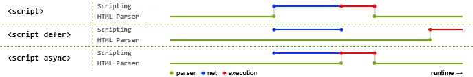

## 事件冒泡
事件流描述的是从页面中接受事件的顺序：事件捕获-处于目标阶段-事件冒泡

注册方式：

* a.onclick
* < div onclick="">
* a.addEventListener('click',fn,true);

使用stopPropagation阻止冒泡

应用：事件委托
	* 只指定一个事件处理程序，管理某一类型的事件

## call 、apply 、bind区别
1. 都是改变改变某个函数运行时的上下文（context）而存在的，即改变this指向
2. 第一个参数都是this要指向的对象，也就是想指定的上下文
3. bind 是返回对应函数，便于稍后调用；apply 、call 则是立即调用
4. call 是按顺序传递参数，apply是可以传递数组

## arguments
arguments对象是所有（非箭头）函数中都可用的局部变量。你可以使用arguments对象在函数中引用函数的参数。是一个类数组对象，用于个 length 属性和若干索引属性。不具有数组所具有的方法
转换方法：

1. [].slice.call(arg)
2. [].splice.call(arg,0)
3. Array.from(arg)
4. [].concat.apply([],arg）

## typeof
1. undefined
2. object
3. boolean
4. number
5. string
6. symbol
7. function
	* typeof function(){} === 'function';
	* typeof class C{} === 'function'
	* typeof Math.sin === 'function'
	* typeof new Function() === 'function'

## 如何区分{}和[] instanceof?

## new运算符发生了什么？
1. 创建一个全新的对象
2. 这个新对象会被执行[[prototype]]链接
3. 这个对象会被绑定到函数运行时候的this
4. 如果函数没有返回对象，new表达式中的 函数调用会自动返回这个新函数

## 对象赋值
* 深赋值
* 浅赋值
	* var newobj=JSON.parse(JSON.stringfy(obj))
	* var newobj=Object.assign({},obj)

## 检查枚举
obj.propertyIsEnumerable(属性) 


## Object.create()
创建一个对象并把这个对象的[[prototype]]关联到指定的对象

## 原型相关函数
1. Foo.prototype.isPrototypeOf(a)  a的整条[[prototype]]链上是否出现过Foo.prototype08
2. Object.getPrototypeOf(a) 获取a的[[prototype]]

## 判断数据类型
* 数组
	* Object.prototype.toString.call(arr) == "[object Array]"
	* Array.isArray(arr)	 

## var let const
* let 和 const 都是可以把变量的作用域限制在当前代码块中
	*  不能重复声明
	*  不存在变量声明提升。JS引擎在扫描代码发现变量声明时，遇到var会提升至作用域顶部。遇到let和const会放到TDZ(临时死区)。访问TDZ中的变量会报错，只有执行过变量声明后的语句，变量才会从TDZ中移除，然后才可以正常访问。
	* const定义的是常量，不允许修改绑定，但允许修改其值，即const一个对象后，可以修改该对象的属性值。
	* const声明后必须立即初始化，否则报错。


使用defineProperty 模拟const

```
Object.defineProperty(obj,"xxx",{
	value:42,
	writable:false,
	configuralbe:false
})
```

## 点击事件触发事件顺序
mousedown -> focus  -> mouseup -> click -> keydown 

## 数组方法
* splice 通过删除现有元素和/或添加新元素来更改一个数组的内容。
	* array.splice(`start`, `deleteCount`, `item1`, `item2`, `...`)
	* 

## CMD 和 AMD
* AMD推崇依赖前置，在定义模块的时候就要声明其依赖的模块  requireJS
* CMD推崇就近依赖，只有在用到某个模块的时候再去require  SeaJS

> AMD和CMD最大的区别是对依赖模块的执行时机处理不同，注意不是加载的时机或者方式不同
  

## < script >标签中的defer和async属性的作用以及二者的区别？




如图所示，正常情况下，js脚本的加载会堵塞主线对页面内容的加载和渲染，它会在加载完后立即执行这段脚本。通常的做法是将js脚本放到文档末端，即当文档全部加载完后，才去加载js脚本，此时js脚本中对dom元素操作的也会成功寻找到相关dom。

defer和async属性是改变了js的加载和执行的顺序。

* defer：用于开启新的线程下载脚本文件，并使脚本在文档解析完成后执行。 
* async：HTML5新增属性，用于异步下载脚本文件，下载完毕立即解释执行代码。 

注意：如果存在多个defer脚本，那么它们是按照顺序执行脚本的，而async，无论声明顺序如何，只要加载完成就立刻执行

## 箭头函数
* 没有this、super、argumentd和new.target绑定
* 不能通过new关键字调用
* 没有原型
* 不可以改变this值
* 不支持arguments对象
* 不支持重复的命名参数


## Array相关のAPI

Array相关的API有很多，有一些也可以用在String上。记起来很麻烦，个人可以认为分为两大类，一种是不改变原数组，另一种是会改变原数组。

不改变原数组：

* join
* concat
* slice
	* 返回数组中的子数组，不改变原数组
	* 两个参数：start 和 end 
	* 返回子数组包含start位置的元素，但是不包含end位置的元素
* 数组的遍历
	* forEach
	* map
	* filter
	* every
	* some
	* reduce和reduceRight
	* find
	* findIndex
	* includes
	* keys (返回遍历器对象)
	* values (返回遍历器对象)
	* entries (返回遍历器对象)

改变原数组：

* push
* pop
* shift
* unshift
* reverse
* sort
	* 如果数组包含undefined元素，会被排到数组的尾部
	* 若不带参数，数组元素会以字母表顺序排序 
* splice
	* 在数组中插入或者删除元素，返回由删除元素组成的数组，如果没有删除元素
	* 第一个参数：插入或者删除的起始位置
	* 第二个参数：删除元素的个数，如果省略，则将从起始位置到数组结尾的所有元素全部删除
	* 剩余参数：需要插入数组中的元素
* copyWithin
* fill

以上的方法都是具体是现在Array.prototype对象上。在ES6中新增API中有些是直接在Array对象实现的，如下：


* Array.isArray
* Array.from
* Array.of

## String相关のAPI


## 如何判断是否是类数组对象

```
function isArrayLike(0){
	if(o && 
		tpyeof o === 'object' &&
		ifFinite(o.lenght) &&
		o.length >= 0 &&
		o.length === Math.floor(o.length) &&
		o.length < 4294967296)
		return true;
	else 
		return false;
}
```

## str[index] 与 str.charAt(index) 区别？
* 当index的取值不在str的长度范围内，返回值不同
	* str[index]返回undefined
	* charAt(index)返回空字符串
* 兼容性
	* charAt是ES3的方法，不适用与IE7及以下
	* string[index]是ES5的方法，兼容性强

## new Date时候，Date是如何区分传入的不同格式的字符串？
字符串`'07/22/2018'`和`'2018/07/22'`在传入Date中，Dated对象会调用parse方法处理字符串，将其转换成对应日期的单位为毫秒的时间戳


## Symbol创建？用途？
Symobl是一种原始数据类型，创建的方式是通过Symbol函数。通常，对象的属性名是字符串，因此可以把对象看成是从字符串到值的映射。但是我们只能通过字符串访问可以访问的属性，无法访问内部属性。


JS中内部属性通常用[[内部属性名]]来表示，比如[[prototype]],表示这个对象的原型对象。Symbol提供了几个静态属性，可以将部分内部属性暴露出来。内部属性的作用是非常强大的，一些基本函数的操作都是通过内部属性来处理的。


